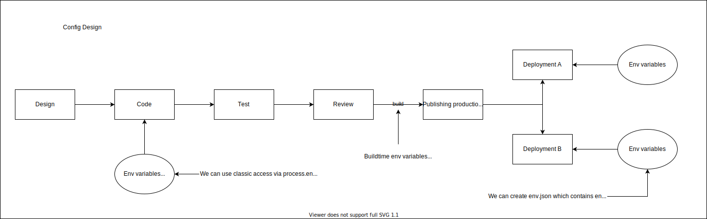

# app-with-config

How to solve the access to environment variables which are set during deployment phase?



You can skip completely the solution with statically-replaced environment variables (e.g. `process.env.MY_VARIABLE` or `import.meta.env.MY_VARIABLE`) and go directly to the solution with variables accessible during runtime.

One of the ways is to fetch json file with these variables. It can contain all related environment variables.

For example you can prefix all FE-related environment variables and then pick them and store them within a new json file which can be placed in public folder.

## How to create `env.json`

### 1. During local development

Copy `env.template.json`, paste it into the `public/` folder and rename it to the `env.json`.
Every change of the `env.json` requires manual refresh of the running app in a browser.

### 2. During deployment (FE is already built)

in Node.js:

```js
/**
 * process.env == { FE_API_URL: 'http://api', NODE_ENV: 'development', ... }
 **/

const envVariables = Object.fromEntries(
  Object.entries(process.env) // => [['FE_API_URL', 'http://api'], ['NODE_ENV', 'development'], ...]
    .filter(([key, value]) => key.startsWith('FE_')) // => [['FE_API_URL', 'http://api']]
    .map(([key, value]) => [key.replace('FE_', ''), value]) // => [['API_URL', 'http://api']]
); // => { API_URL: 'http://api' }

// write it in the server root folder (<server-root>/env.json)
```

in Bash:

```bash
jq 'env | with_entries(select(.key | startswith("FE_")) | .key = (.key | ltrimstr("FE_")))' -n
```

- `env` - object with env variables `{ 'FE_API_URL': 'http://api', ... }`
- `env | with_entries(<pipeline>)` - like in JS: `Object.fromEntries(Object.entries(env)<pipeline ~ .filter(...).map(...)>)`
- `select(.key | startswith("FE_"))` - like in JS: `.filter(([key, value]) => key.startsWith('FE_'))`
- `.key = (.key | ltrimstr("FE_"))` - like in JS: `.map(([key, value]) => [key.replace('FE_', ''), value])`

## How to use

### Requirements

- Node.js
- Yarn v1

### Install deps

```
yarn install
```

### Start dev server

```
yarn dev
```

### Format code

```
yarn format --write
```

### Lint code

```
yarn lint
```

### Check types

```
yarn types
```

### Run tests

```
yarn test
```

### Build production-ready app

```
yarn build
```

### Serve production-ready app

```
yarn serve
```
